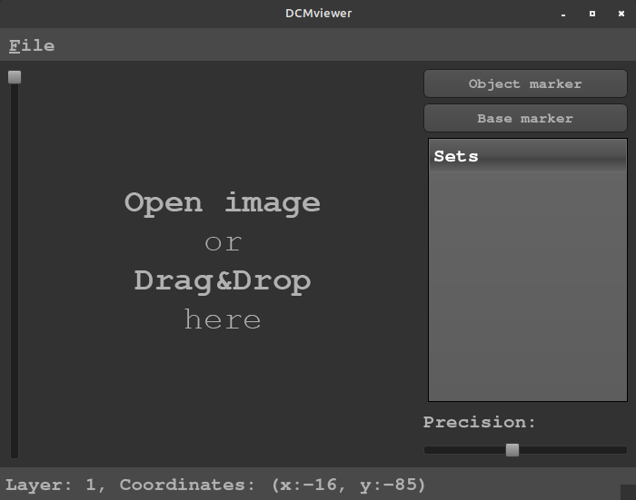

# DCMviewer

Software that allow viewing .dcm files written in Python and PyQt5.
Created markers are exported in CSV format.



# Tips

Scrollwheel allow to move on depth/timeline.

Pressing LMB and draging allow to make continous marker line.

Precision slider is used for determin how long are lines is continous mode.

# Development

### Environment setup

```
python -m venv <env-name>
```

### Environment activation on Windows

```
<env-name>\Scripts\activate
```

### Environment activation on Linux

```
source <env-name>\bin\activate
```

### Install dependencies

```
pip install -r requirements.txt
```

# Other
Example DICOM files:
http://www.rubomedical.com/dicom_files/
